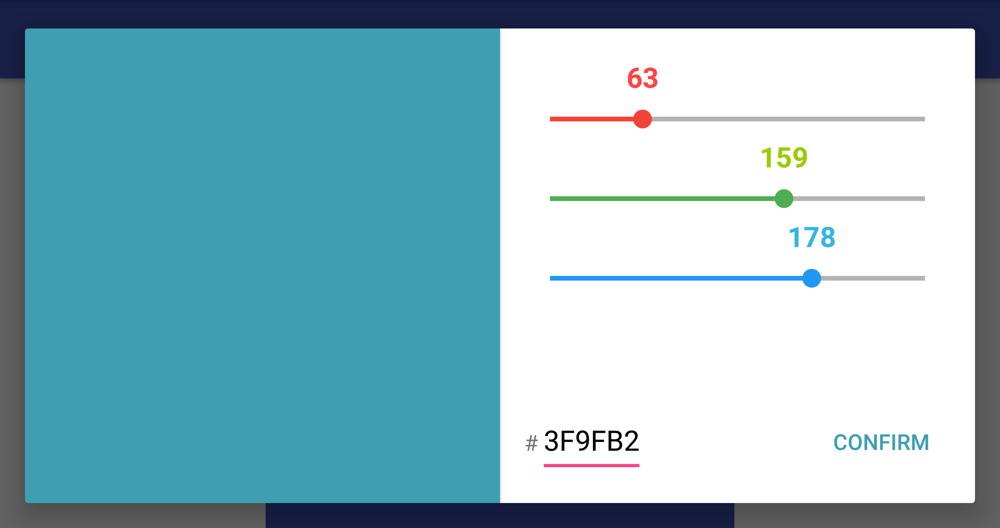

# Android Material Color Picker Dialog
A simple, minimalistic and beautiful dialog color picker for Android 4.1+ devices. This color picker is easy-to-use and easy-to-integrate in your application to let users of your app choose color in a simple way.

NOTE: The original library can be viewed [here](https://github.com/Pes8/android-material-color-picker-dialog), this merely adds a few extra customization options

Features
- Get Hex and (A)RGB color codes
- Set color using (A)RGB values and get HEX codes
- Set color using HEX value
- Separate UI for portrait and landscape devices
- Support for pre-lollipop devices

Design inspired from [Dribbble](https://dribbble.com/shots/1858968-Material-Design-colorpicker) by Lucas Bonomi

Portrait

 

Landscape




## HOW TO USE IT

### Adding the library to your project
The aar artifact is available at the **jcenter** repository. Declare the repository and the
dependency in your `build.gradle`.
    
(root)
```groovy
repositories {
    jcenter()
}
```
    
(module) 
using Gradle:
```groovy    
dependencies {
    compile 'com.cameron.materialcolorpicker:materialcolorpicker:2.0.0'
}
```
using Maven:
```XML
<dependency>
    <groupId>com.cameron.materialcolorpicker</groupId>
    <artifactId>materialcolorpicker</artifactId>
    <version>2.0.0</version>
    <type>pom</type>
</dependency>
```

### Use the library

Create a color picker dialog object

```java
ColorPicker colorPicker = new ColorPicker(context, red, green, blue);
```

red, green, and blue are 3 integers (with value ranging from 0 to 255) to be used for the initialization of the color picker with your custom color value. If you don't want to start with a color set them to 0 or use only the first argument.

The library also supports alpha values. If no color or only red, green, and blue are specified, the alpha value is set to 255.

Use the following constructor to specify an alternative alpha channel value (0..255). As soon as the alpha value constructor is used, a fourth slider will appear above the RGB sliders and the text input field will change from six HEX characters to eight.

```java
ColorPicker colorPicker = new ColorPicker(context, alpha, red, green, blue);
```

You can show the dialog directly after this or customize it, as shown below. Note that if your activity does not directly 
implement the `ColorPickerCallback` interface, you can set an callback manually.

```java
// Various configurations, all of the below are optional
colorPicker.setCloseOnDialogButtonPressed(true)
        .setDialogButtonText("CONFIRM")       // The default text is "SUBMIT"
        .setCloseOnBackPressed(false)         // The default value is true 
        .showButtonAsTransparent(true)        // The default value is false
	.setCloseOnDialogButtonPressed(false) // The default value is true
// Set a new Listener called when user click "select"
colorPicker.setCallback(new ColorPickerCallback() {
    @Override
    public void onColorChosen(@ColorInt int color, String hex, String hexNoAlpha) {
        Log.d("Pure color", String.valueOf(color));
        Log.d("Alpha", Integer.toString(Color.alpha(color)));
        Log.d("Red", Integer.toString(Color.red(color)));
        Log.d("Green", Integer.toString(Color.green(color)));
        Log.d("Blue", Integer.toString(Color.blue(color)));
        Log.d("Hex with alpha", hex);
        Log.d("Hex no alpha", hexNoAlpha);
        // Once the dialog's select button has been pressed, we
        // can get the selected color and use it for the
        // background of our view
        colorView.setBackgroundColor(color);
    }

    /**
     * When the color values from the dialog are changed, this method will
     * be called. Here, we'll just change the color of the dialog's button.
     */
    @Override
    public void onColorChanged(@ColorInt int color, String hex, String hexNoAlpha) {
        Log.d("Color", String.valueOf(color));
        Log.d("Hex", hex);
        Log.d("Hex no alpha", hexNoAlpha);
        // Save the color selected so we can retrieve it again
        // when the device is rotated
        currentColor = color;
        colorPicker.setDialogButtonTextColor(color);
    }
});
```

## Translations
### Available Languages
* English
* Italian
* German
* French
* Spanish
* Iranian
* Persian
* Korean
* Turkish
* Russian

## Contributors

Author: [Simone Pessotto](https://www.simonepessotto.it)

### Special thanks to :

[Patrick Geselbracht](https://github.com/PattaFeuFeu)

## LICENSE

```
The MIT License (MIT)

Copyright (c) 2017 Simone Pessotto (http://www.simonepessotto.it)

Permission is hereby granted, free of charge, to any person obtaining a copy
of this software and associated documentation files (the "Software"), to deal
in the Software without restriction, including without limitation the rights
to use, copy, modify, merge, publish, distribute, sublicense, and/or sell
copies of the Software, and to permit persons to whom the Software is
furnished to do so, subject to the following conditions:

The above copyright notice and this permission notice shall be included in all
copies or substantial portions of the Software.

THE SOFTWARE IS PROVIDED "AS IS", WITHOUT WARRANTY OF ANY KIND, EXPRESS OR
IMPLIED, INCLUDING BUT NOT LIMITED TO THE WARRANTIES OF MERCHANTABILITY,
FITNESS FOR A PARTICULAR PURPOSE AND NONINFRINGEMENT. IN NO EVENT SHALL THE
AUTHORS OR COPYRIGHT HOLDERS BE LIABLE FOR ANY CLAIM, DAMAGES OR OTHER
LIABILITY, WHETHER IN AN ACTION OF CONTRACT, TORT OR OTHERWISE, ARISING FROM,
OUT OF OR IN CONNECTION WITH THE SOFTWARE OR THE USE OR OTHER DEALINGS IN THE
SOFTWARE.
```
